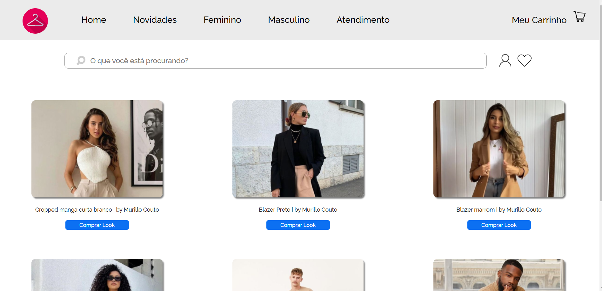

	

	<h1>Ecommerce Vestuário</h1>

### O que é? 🤔
Um Market Place feito com ReactJs, o foco foi o estudo das rotas utilizando o react router dom e a utilização de props para carregar componentes de forma dinâmica, puxando os dados de um mock. O site não tem qualquer tipo de verificação para fazer o login nem mesmo funcionalidades além de selecionar a peça de roupa e encaminhar para o pagamento.

### Quais tecnologias foram usadas? 💻
- HTML5
- CSS3 (SASS)
- Javascript (ReactJs)

### Está online? 📡
SIM! Basta [clicar aqui](https://ecommerce-react-lilac-three.vercel.app/) para visualizar o site que está hospedado nos servidores da Vercel.

by Murillo Couto 
[GitHub](https://github.com/MurilloCouto)
